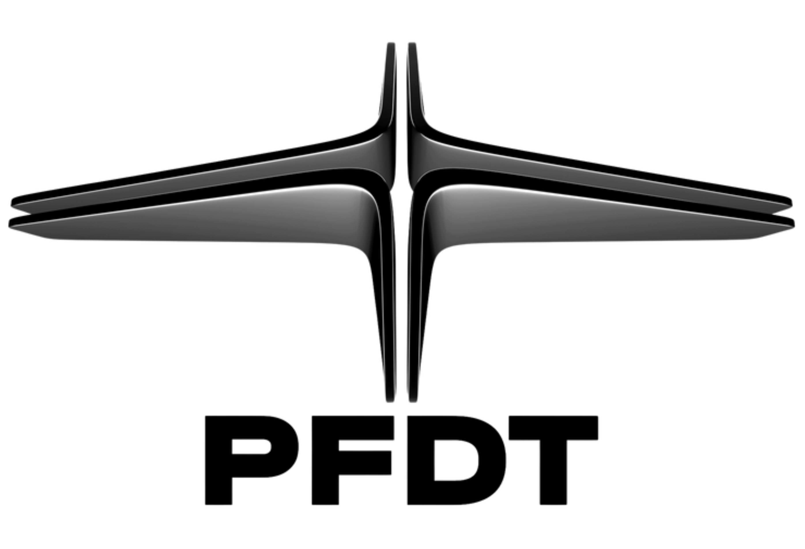

<div align="center">



# Person Tracking Drone

**Autonomous person-following system for VTOL platforms**

Jetson Orin · SIYI A8 mini · Orange Cube+ (ArduPilot) · YOLOv8 · TensorRT

[](https://www.python.org/)
[](https://developer.nvidia.com/embedded/jetpack)
[](https://developer.nvidia.com/cuda-toolkit)
[](https://developer.nvidia.com/tensorrt)
[](https://ardupilot.org/copter/)
[](https://mavlink.io/)
[](#testing)
[]()

</div>

---

> [!WARNING]
> ### Confidentiality Notice
>
> This software is the proprietary property of
> **Parashar Future Defence Technologies Pvt. Ltd. (PFDT)**.
>
> All source code, documentation, models, schematics, and accompanying
> materials are confidential. Access, reproduction, distribution,
> reverse-engineering, or use of any kind is **strictly prohibited
> without prior written authorisation** from PFDT.
>
> If you have obtained this repository in error, contact PFDT immediately
> and delete all copies in your possession.

---

## Table of Contents

1. [Overview](#1-overview)
2. [Tech Stack](#2-tech-stack)
3. [Hardware Requirements](#3-hardware-requirements)
4. [System Architecture](#4-system-architecture)
5. [Installation](#5-installation)
6. [Quick Start](#6-quick-start)
7. [Operating Procedure](#7-operating-procedure)
8. [Manual Control](#8-manual-control)
9. [Command Reference](#9-command-reference)
10. [HTTP API](#10-http-api)
11. [Streaming Protocol](#11-streaming-protocol)
12. [Safety System](#12-safety-system)
13. [State Machine](#13-state-machine)
14. [Configuration](#14-configuration)
15. [ArduPilot Parameters](#15-ardupilot-parameters)
16. [Logs & Recording](#16-logs--recording)
17. [Remote Operation (Tailscale)](#17-remote-operation-tailscale)
18. [Testing](#18-testing)
19. [Project Layout](#19-project-layout)
20. [Shutdown](#20-shutdown)

---

## 1. Overview

A production-grade autonomous person-following stack for rotary-wing UAVs.
Combines a high-rate gimbal-PID inner loop with a proportional drone-body
outer loop, EKF-smoothed geolocation, multi-stage search escalation,
persistent person re-identification, and an enforced software safety
stack including operator E-STOP, preflight readiness gate, active retreat
behaviour, FPS floor, and RC-override lock-out.

**Key capabilities**

- Real-time YOLOv8 person detection at 25–30 fps on Jetson Orin Nano.
- ByteTrack multi-object tracking with stable persistent IDs.
- HSV-histogram re-identification across temporary occlusions.
- Hybrid two-loop control: gimbal 30 Hz, drone body 10 Hz.
- 4-state Extended Kalman Filter for person geolocation.
- 4-stage search escalation: sector → expanding square → Lissajous.
- Web-based operator interface with click-to-track, manual gimbal, and
  one-tap E-STOP.
- Software dry-run mode for safe rehearsal of the entire pipeline.
- Structured JSONL flight-event log for post-incident review.

---

## 2. Tech Stack

<div align="center">

| Layer | Technology |
|:---|:---|
| **Compute** | NVIDIA Jetson Orin Nano Super · Jetson Orin NX |
| **OS / SDK** | JetPack 6.0+ · CUDA 12.x · cuDNN |
| **Detection** | YOLOv8 · Ultralytics · TensorRT (FP16 engine) |
| **Tracking** | ByteTrack · HSV-histogram re-identification |
| **State Estimation** | Custom 4-state Extended Kalman Filter |
| **Gimbal Control** | Discrete PID · SIYI SDK v2.0 (UDP) |
| **Drone Control** | Proportional + EMA + jerk + accel limiter · `pymavlink` |
| **Flight Controller** | Cube Orange+ (Hex) · ArduCopter (GUIDED mode) |
| **Camera Ingest** | RTSP H.264 · OpenCV · GStreamer · NVDEC (HW decode) |
| **Operator UI** | MJPEG over HTTP · Vanilla JS · Zero plugins |
| **Recording** | H.264 · NVENC (`nvv4l2h264enc`) · `x264enc` fallback |
| **Language** | Python 3.10 |
| **Testing** | `pytest` — 170 unit tests |
| **Logging** | Structured JSONL events + stdout tee |
| **Remote Access** | Tailscale (zero-config WireGuard) |

</div>

---

## 3. Hardware Requirements

<div align="center">

| Component | Specification |
|:---|:---|
| **Companion computer** | Jetson Orin Nano Super / Orin NX (JetPack 6+) |
| **Gimbal + camera** | SIYI A8 mini — Wi-Fi `192.168.144.25` · UDP `:37260` · RTSP `:8554/main.264` |
| **Flight controller** | Cube Orange+ (or any ArduCopter 4.5+ FCU) |
| **FCU link** | USB serial · `/dev/ttyACM0` · 921 600 baud |
| **Battery** | 3S–6S LiPo (auto-detected; override via `--cells N`) |
| **RC system** | Any TX/RX bound to FCU — required for manual override |
| **Optional** | RTK GPS for sub-metre position, Tailscale gateway for remote ops |

</div>

---

## 4. System Architecture

```
                       ┌─────────────────────────┐
       RTSP H.264  ──▶ │   FrameGrabber          │  Zero-latency NVDEC
                       └────────────┬────────────┘
                                    ▼
                       ┌─────────────────────────┐
                       │   YOLO + ByteTrack      │  TensorRT · GPU
                       └────────────┬────────────┘
                                    ▼
                       ┌─────────────────────────┐
                       │   PersonRegistry        │  HSV histogram re-ID
                       └────────────┬────────────┘
                                    ▼
                       ┌─────────────────────────┐
                       │   State Machine (8)     │  WAITING / SCAN /
                       │                         │  TRACK / PREDICT …
                       └────┬───────────────┬────┘
                            │               │
              30 Hz inner   │               │   10 Hz outer (--drone)
                            ▼               ▼
                 ┌──────────────────┐ ┌────────────────────────┐
                 │  Gimbal PID      │ │  DroneController       │
                 │  + Search        │ │  + EKF + Safety stack  │
                 └──────────┬───────┘ └───────────┬────────────┘
                            │                     │
                       SIYI UDP             MAVLink serial
                            │                     │
                            ▼                     ▼
                     ┌────────────┐         ┌────────────┐
                     │ SIYI A8    │         │ Cube       │
                     │ Mini       │         │ Orange+    │
                     └────────────┘         └────────────┘
```

---

## 5. Installation

```bash
# JetPack 6 ships Python 3.10. From the project root:
pip install -r requirements.txt

# Drone-body control (only required for --drone mode)
pip install pymavlink

# GStreamer NVDEC/NVENC plugins ship with JetPack 6 by default:
#   gstreamer1.0-plugins-bad, nvv4l2decoder, nvv4l2h264enc
```

---

## 6. Quick Start

```bash
cd /home/ai-engineer/Akash/Tasks/Akash/AI/Jetson/person_tracking
```

Three launch modes:

<table>
<tr><th>Mode</th><th>Command</th><th>Use case</th></tr>
<tr>
  <td><b>Gimbal-only</b></td>
  <td><code>python3 main.py</code></td>
  <td>Safest first run · no MAVLink · camera + gimbal tracking only</td>
</tr>
<tr>
  <td><b>Ground-test (dry-run)</b></td>
  <td><code>python3 main.py --drone --ground-test</code></td>
  <td>Full pipeline executes but <b>no MAVLink TX</b> · bench rehearsal with a real subject</td>
</tr>
<tr>
  <td><b>Live flight</b></td>
  <td><code>python3 main.py --drone</code></td>
  <td>Autonomous drone-body following · requires GUIDED mode and a passing preflight</td>
</tr>
</table>

Then open the operator UI: **`http://<jetson-ip>:8080/`**

---

## 7. Operating Procedure

### 7.1 Pre-flight (every session)

1. Power on SIYI camera (Wi-Fi 192.168.144.x).
2. Power on the airframe — Cube Orange+ enumerates over USB.
3. Power on the **RC transmitter**. Mode switch on **LOITER** or **STABILIZE** (**NOT** GUIDED).
4. Launch `main.py` on the Jetson.
5. Open `http://<jetson-ip>:8080/` in a browser.

### 7.2 Gimbal tracking (camera only)

1. Click on the subject in the live video.
2. Gimbal locks · HUD displays `LOCK ID N`.
3. Click empty space (or **UNLOCK**) to release.

### 7.3 Autonomous drone-body following

1. Pilot switches RC mode to **GUIDED**.
2. In the web UI header, click **ARM ▾** — preflight panel opens.
3. Wait until **all 10 checks turn green**:
   - MAVLink link · Heartbeat · GUIDED mode · ARMED · HOME set
   - GPS quality (fix · HDOP · sats) · Sensors · Geofence
   - Battery · ArduPilot parameters
4. Click **Arm Tracker**.
5. Click on the subject in the video → drone follows at
   `FOLLOW_STANDOFF_M = 8 m` horizontal, `FOLLOW_ALTITUDE_M = 12 m` AGL.
6. Click **Disarm** to stop body motion (gimbal continues tracking).

---

## 8. Manual Control

Three independent layers of operator authority, all reachable at any moment:

<div align="center">

| Goal | Action | Effect |
|:---|:---|:---|
| **Take over flight** | RC mode switch → any non-GUIDED mode | FCU stops accepting our commands instantly. RC-override latch trips — auto-follow cannot resume until preflight + re-Arm |
| **Take over camera** | Web UI **AUTO** button → **MANUAL** | On-screen D-pad appears; arrow keys / D-pad drive pan/tilt |
| **Emergency stop** | Web UI red **E-STOP** button — or **Space** key | 1st press → BRAKE. 2nd press within 3 s → LAND. Always reachable, token-bypass |

</div>

### RC link conditions

**Required for autonomous following:**
- Transmitter powered ON, bound to receiver.
- Mode switch on **GUIDED**.
- Throttle stick above failsafe trigger.
- RC link healthy (no loss-of-link warning on the FCU).

**Required for manual recovery (always available):**
- Transmitter must stay powered in the safety pilot's hand throughout flight.
- Any non-GUIDED mode flip = instant takeover.

---

## 9. Command Reference

### 9.1 CLI flags

```
python3 main.py [--drone] [--ground-test] [--cells N]
                [--device PATH] [--baud N]
                [--model PATH] [--calibration PATH] [--detect-device DEV]
                [--stream-host HOST] [--stream-token TOKEN]
```

| Flag | Default | Description |
|:---|:---|:---|
| `--drone` | off | Enable MAVLink drone-body following |
| `--ground-test` | off | Dry-run: full pipeline, no MAVLink TX |
| `--cells N` | 0 (auto) | Force battery cell count (3–6) — useful on partial charge |
| `--device PATH` | `/dev/ttyACM0` | MAVLink serial device |
| `--baud N` | 921600 | Serial baud rate |
| `--model PATH` | `models/yolo26s.engine` | YOLO TensorRT engine |
| `--detect-device DEV` | `auto` | `auto` · `cpu` · `cuda:0` |
| `--calibration PATH` | — | OpenCV calibration YAML (else auto from HFOV=81°) |
| `--stream-host HOST` | `127.0.0.1` | Bind address. `0.0.0.0` for LAN / Tailscale |
| `--stream-token TOKEN` | — | Auth token on control endpoints |

### 9.2 Keyboard (display window open)

| Key | Action | Key | Action |
|:---:|:---|:---:|:---|
| `q` | Quit | `t` | Toggle tracking |
| `r` | Center gimbal + zoom reset | `s` | Toggle search |
| `i` | Restart initial scan | `d` | Toggle display |
| `z` / `x` | Zoom in / out | `a` | Toggle auto-zoom |
| `v` | Toggle recording | `l` | Toggle live stream |
| `+` / `-` | Adaptive Kp gain | `[` / `]` | Max gimbal speed |
| `m` | Toggle AUTO / MANUAL | `←↑↓→` | Manual gimbal (MANUAL only) |

### 9.3 Terminal (headless / SSH)

```
track <id>   Lock to persistent person ID
unlock       Release lock
ids          Print currently detected IDs
q            Quit
```

---

## 10. HTTP API

<div align="center">

| Endpoint | Auth | Description |
|:---|:---:|:---|
| `/` | — | Operator HTML page |
| `/stream` | — | MJPEG over HTTP (`multipart/x-mixed-replace`) |
| `/status` | — | Live telemetry JSON · mode, GPS, batt, fence, RC-override, FPS, tracking-loss dt |
| `/preflight` | — | Preflight checklist JSON · `{items, all_ok, armed}` |
| `/click?x=&y=` | token | Lock to normalised (x, y) |
| `/unlock` | token | Release lock |
| `/mode?set=auto\|manual` | token | Set tracker mode |
| `/gimbal?dir=up\|down\|left\|right\|stop` | token | Manual gimbal nudge (MANUAL only) |
| `/zoom_in` / `/zoom_out` | token | Gimbal zoom |
| `/arm_tracker?on=true\|false` | token | Arm or disarm drone-body following |
| `/estop` | **always** | 1st press → BRAKE · 2nd press within 3 s → LAND |

</div>

When `--stream-token` is set, control endpoints require `?token=YOURSECRET`.
The `/estop` endpoint intentionally bypasses this — life safety always reachable.

---

## 11. Streaming Protocol

<div align="center">

| Leg | Protocol | Notes |
|:---|:---|:---|
| Camera → Jetson | **RTSP / H.264** | `rtsp://192.168.144.25:8554/main.264` · NVDEC hardware decode |
| Jetson → operator | **MJPEG over HTTP** | `Content-Type: multipart/x-mixed-replace` · two qualities served (`?q=hi` 720p, `?q=lo` 480p) · 25 fps cap |

</div>

MJPEG was chosen over WebRTC/HLS for **sub-second latency** and **zero-plugin browser support** (any browser, VLC, ffplay, or OpenCV viewer can consume it).

---

## 12. Safety System

Every rule is enforced before any MAVLink command leaves the Jetson.

<div align="center">

| Layer | Rule |
|:---|:---|
| **Altitude floor / ceiling** | Commands clamped to `[MIN_ALT_M, MAX_ALT_M] = [10, 80] m` |
| **Horizontal speed cap** | ≤ `MAX_TRACKING_SPEED_MS = 5 m/s` |
| **Vertical speed cap** | ≤ 2.5 m/s |
| **Acceleration cap** | `MAX_ACCEL_MS2 = 2.0 m/s²` after jerk limiter |
| **App geofence** | 500 m circular · checked on current AND commanded target |
| **FCU geofence** | Verified at preflight (`FENCE_ENABLE`, `FENCE_RADIUS`, `FENCE_ALT_MAX`) |
| **HOME keep-out** | 5 m no-fly cylinder around launch point |
| **MAVLink watchdog** | Stale > 2.0 s → stop · warn at 1.0 s |
| **GPS quality** | Fix ≥ 3D · HDOP ≤ 1.5 · sats ≥ 10 · EKF variance ≤ 1.0 |
| **EKF jump reject** | Measurements > 10 m from current state discarded |
| **Battery critical** | Per-cell V < 3.5 → RTL with retry · cell override via `--cells` |
| **Body-move confirm** | 5 consecutive valid detections required before drone body moves |
| **FPS floor** | Body holds when effective FPS < 8 |
| **Session timer** | Auto RTL after `MAX_FLIGHT_TIME_S = 600 s` |
| **Retreat + hysteresis** | 1 m/s active retreat when sep < 4 m · resume above 5.5 m |
| **RC override** | GUIDED → other mode latches · cleared only by re-arm after preflight |
| **Software E-STOP** | Web button + Space key · BRAKE → LAND escalation |

</div>

### Tracking-loss failsafe ladder

```
0 – 2 s    →  EKF prediction · drone keeps velocity
2 – 5 s    →  Zero velocity · drone decelerates
5 – 15 s   →  LOITER command · FCU holds position
   > 15 s  →  Stay in LOITER · operator decides
              (never auto-RTL on tracking loss alone)
```

---

## 13. State Machine

<div align="center">

| State | Trigger | Description |
|:---|:---|:---|
| `INITIAL_SCAN` | Power-on | 3-level raster acquisition (MDPI Drones 2024) |
| `TRACKING` | Person detected | Gimbal PID centring |
| `PREDICTING` | Lost 0–3 s | Full-speed velocity extrapolation |
| `PRED_FADE` | Lost 3–6 s | Tapering prediction (down to 30 %) |
| `SEARCHING` | Lost ≥ 6 s | Velocity-biased sector scan |
| `EXPANDING_SQUARE` | Sector timeout (15 s) | IAMSAR expanding square |
| `LISSAJOUS` | Expand timeout (45 s) | Sinusoidal fill (T_yaw/T_pitch ≈ √2/√3) |
| `WAITING` | Tracking disabled | Idle |

</div>

---

## 14. Configuration

All tunables live in [`config/config.py`](config/config.py). Highlights:

| Parameter | Default | Description |
|:---|:---|:---|
| `MODEL_PATH` | `models/yolo26s.engine` | YOLO engine |
| `CONF_THRESHOLD` | `0.45` | Detection confidence floor |
| `FOLLOW_ALTITUDE_M` | `12 m` | Target AGL altitude |
| `FOLLOW_STANDOFF_M` | `8 m` | Horizontal offset from subject |
| `MIN_PERSON_DRONE_SEP_M` | `4 m` | Retreat trigger |
| `RETREAT_HYSTERESIS_M` | `1.5 m` | Re-engage buffer |
| `RETREAT_SPEED_MS` | `1.0 m/s` | Retreat velocity |
| `BODY_MOVE_CONFIRM_FRAMES` | `5` | Frames before body moves |
| `MIN_TRACKING_FPS` | `8.0` | FPS floor for body motion |
| `MAX_FLIGHT_TIME_S` | `600 s` | Auto-RTL deadline |
| `HEARTBEAT_WATCHDOG_S` | `2.0 s` | MAVLink HB timeout |
| `BEARING_LATCH_S` | `1.0 s` | Sustained motion before standoff-bearing switch |
| `EKF_MAX_JUMP_M` | `10 m` | Measurement-rejection threshold |
| `STREAM_PORT` | `8080` | MJPEG HTTP port |
| `STREAM_MAX_FPS` | `25` | Stream cap |
| `AUTO_RECORD` | `True` | Auto-record on launch |

---

## 15. ArduPilot Parameters

Verified at preflight — **arming is refused** if any are wrong.

### Required

```ini
GUID_TIMEOUT     > 0       # GUIDED-mode command-loss timeout
FENCE_ENABLE     = 1       # Onboard geofence ON
FENCE_RADIUS    >= 500     # ≥ app GEOFENCE_RADIUS_M
FENCE_ALT_MAX   >= 80      # ≥ app MAX_ALT_M
RTL_ALT         >= 2000    # cm — i.e. ≥ 20 m
BATT_FS_LOW_ACT >= 2       # 2 = RTL, 3 = LAND
FS_GCS_ENABLE    = 1       # GCS-heartbeat failsafe ON
```

### Recommended

```ini
WPNAV_SPEED   = 500     # cm/s = 5 m/s
WPNAV_ACCEL   = 150     # cm/s²
PSC_JERK_XY   = 3.0     # m/s³
FENCE_ALT_MIN = 10
```

---

## 16. Logs & Recording

<div align="center">

| Artefact | Path |
|:---|:---|
| Session stdout/stderr | `logs/gimbal_track_YYYY-MM-DD_HH-MM-SS.log` |
| Structured flight events (JSONL) | `logs/flight_YYYYMMDD_HHMMSS.jsonl` |
| Video recording (H.264 MP4) | `recordings/track_YYYY-MM-DD_HH-MM-SS_WxH.mp4` |

</div>

JSONL events emitted: `arm`, `disarm`, `estop`, `mode_change`, `rc_override`,
`session_rtl`, `fps_floor`, `safety_warning`, `log_open`.

---

## 17. Remote Operation (Tailscale)

```bash
sudo tailscale up
tailscale ip -4              # note the IP

# Launch with token + LAN exposure
python3 main.py --drone --stream-host 0.0.0.0 --stream-token MYSECRET

# From any device on the tailnet:
#   http://<tailscale-ip>:8080/?token=MYSECRET
```

---

## 18. Testing

```bash
pytest -q
# 170 passed
```

| Domain | Test files |
|:---|:---|
| **Safety** | `test_safety.py`, `test_preflight.py`, `test_param_verifier.py`, `test_home_keepout.py`, `test_retreat.py`, `test_body_confirm.py`, `test_ekf_jump.py`, `test_accel_cap.py`, `test_bearing_hysteresis.py`, `test_gps_quality.py`, `test_estop.py`, `test_rc_override.py`, `test_fps_floor.py`, `test_session_rtl.py`, `test_cells_override.py`, `test_ground_test_mode.py`, `test_flight_log.py`, `test_status_telemetry.py` |
| **Tracking** | `test_target_detection.py`, `test_target_selector.py`, `test_tracker_web_click.py`, `test_standoff.py`, `test_drone_target_geofence.py` |
| **Control** | `test_pid.py`, `test_mavlink_ack.py` |
| **Web UI** | `test_stream_token_html.py`, `test_query_parse.py` |

---

## 19. Project Layout

```
person_tracking/
├── assets/
│   └── pfdt_logo.png               PFDT brand mark
├── main.py                         Entry point — CLI, banner, log setup
├── tracker.py                      Orchestrator — state machine + main loop
├── config/
│   ├── config.py                   Tunable parameters
│   └── settings.py                 Immutable Settings dataclass
├── detection/
│   └── detector.py                 YOLO TensorRT + ByteTrack
├── gimbal/
│   ├── siyi_controller.py          SIYI SDK v2.0 over UDP
│   └── auto_zoom.py                Optional auto-zoom
├── control/
│   ├── pid_controller.py           Discrete PID + EMA smoother
│   ├── search_patterns.py          4-stage search escalation
│   └── drone_controller.py         Outer loop — EKF + safety + retreat
├── tracking/
│   ├── state_machine.py            8-state FSM
│   ├── person_registry.py          HSV histogram re-ID
│   ├── velocity_tracker.py         Recency-weighted velocity
│   ├── person_geolocation.py       Pixel → GPS + 4-state EKF
│   ├── tracker_state.py            Shared mutable state
│   ├── target_selector.py          Target selection (lock / largest)
│   ├── target_detection.py         TargetDetection dataclass
│   ├── gimbal_state_machine.py     Gimbal FSM
│   └── operator_input.py           Keyboard / terminal handler
├── mavlink_client/
│   ├── mavlink_client.py           Thread-safe pymavlink wrapper
│   └── param_verifier.py           FCU parameter verifier
├── safety/
│   ├── safety.py                   Altitude, speed, geofence, watchdog, batt, keep-out
│   └── preflight.py                Preflight checklist
├── gcs/
│   ├── stream_server.py            MJPEG HTTP + click-to-track UI + E-STOP
│   └── web_control_adapter.py      Web callback handlers
├── mission/
│   ├── hud_renderer.py             On-screen HUD
│   ├── recording_manager.py        Recording lifecycle
│   └── stream_adapter.py           Stream-loop adapter
├── utils/
│   ├── frame_grabber.py            RTSP capture (NVDEC)
│   ├── video_recorder.py           H.264 record (NVENC)
│   ├── flight_log.py               JSONL structured event log
│   └── logger.py                   stdout tee
├── tests/                          170 pytest tests
└── models/
    └── yolo26s.engine              YOLOv8 TensorRT engine
```

---

## 20. Shutdown

```
Ctrl-C       (in the terminal running main.py)
   — or —
q + Enter    (terminal mode)
   — or —
q key        (display mode)
```

Session log, flight log, and video recording are all closed cleanly on exit.

---

<div align="center">

### Proprietary · Confidential · Internal Use Only

© Parashar Future Defence Technologies Pvt. Ltd. — All rights reserved.

Unauthorised access, reproduction, or distribution is prohibited.


</div>
